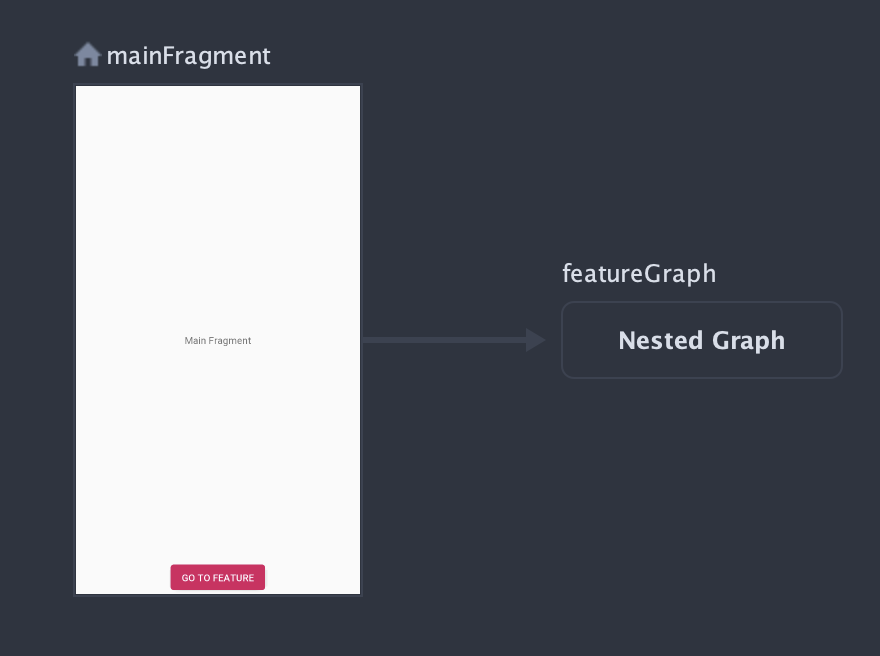

# dynamic-navigation
dynamic-navigation is a helper library for supporting [dynamic features](https://developer.android.com/studio/projects/dynamic-delivery) when using [AAC Navigation](https://developer.android.com/guide/navigation/).

## Getting Started


```xml
<?xml version="1.0" encoding="utf-8"?>
<navigation xmlns:android="http://schemas.android.com/apk/res/android"
  xmlns:app="http://schemas.android.com/apk/res-auto"
  xmlns:tools="http://schemas.android.com/tools"
  android:id="@+id/main"
  app:startDestination="@id/mainFragment">
  <fragment
    android:id="@+id/mainFragment"
    android:name="com.epishie.dynamicnavigation.example.MainFragment"
    android:label="MainFragment"
    tools:layout="@layout/fragment_main" >
    <action
      android:id="@+id/action_mainFragment_to_featureGraph"
      app:destination="@id/featureGraph" />
  </fragment>
  <dynamicGraph
    android:id="@+id/featureGraph"
    app:graphPackage="com.epishie.dynamicnavigation.example.examplefeature"
    app:graphName="feature" />
</navigation>
```

### Include dependency
```gradle
dependencies {
  // ...
  implementation 'com.epishie:dynamic-navigation:0.1.0'
  // ...
}
```

### Add to Navigation resource
Instead of using `<include />` use `<dynamicGraph />` to reference a navigation graph from a feature module.
```xml
<dynamicGraph
  android:id="@+id/featureGraph"
  app:graphPackage="com.epishie.dynamicnavigation.example.examplefeature"
  app:graphName="feature" />
```
